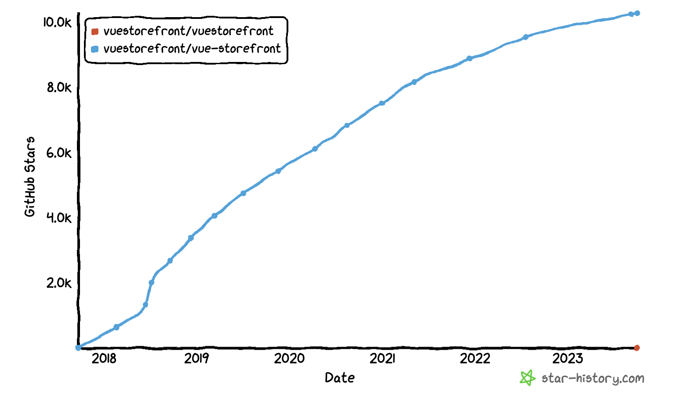

Every successful open source project I've seen has been treated **like a legit product**. They've got a dedicated **product owner**, a well-defined **structure**, a clear **roadmap**, and a solid **marketing strategy**. Now, the first thing you gotta ask yourself is: why are you going open source?

If your answer sounds something like: "Oh, we've got some bits of code we can just chuck up on Github. It's low hanging fruit, everyone's doing it" - well, buddy, **that project's not gonna take off.** People can tell when there's no real commitment or motivation, and that's a surefire way to have your project gather dust before it even gets off the ground.

With open source you’re addressing **developers**. Developers are your users. The group of people with the **most sensitive bullshit radar you can ever address.**

Now, don't get me wrong, the steps to turn a project into a successful product are pretty simple, but that doesn't mean it's a walk in the park.

There could be a ton of reasons to go open source, and not all software has what it takes to soar on Github. But don't worry, I've got some practical tips on figuring out what to open source. These are based on the Catch The Tornado principles we've been using for over 6 years now.

_Successful Github projects growth is a hockey stick. This is the Github stars chart from VSF ([https://github.com/vuestorefront/vue-storefront](https://github.com/vuestorefront/vue-storefront)). This is definitely the trajectory you’re looking for deciding WHAT to open source first, and then aiming with the all marketing activities._

## Why?

Open source projects serve as potent platforms that attract clients, partners, and foster community building, aligning with strategic goals.

What’s your motivation and the goal - is probably the question you need to answer it first. If you already did the following ideas might be obvious either boring but I just put it here to market the open source for the undecided business makers. You can copy and paste it to email to your boss. No need to thank me ;)

1. **Attracting Clients, Partners, and Building Community:** An open source project acts as a powerful magnet that draws potential clients, partners, and an engaged community. It's a platform that showcases your capabilities while also establishing a shared space for collaboration and discussion. Community building isn't merely a byproduct of open source projects, it's a strategic goal that fuels the project's growth and sustainability.
2. **Demonstrating Quality and Expertise:** Open sourcing your code is a testament to the high standards of your work and your commitment to quality. It positions you as an industry leader, setting the bar high and attracting talented individuals who are interested in working with superior engineering practices.
3. **Establishing Authority:** Being the author of an open source project not only showcases your expertise in the chosen technology but also positions you as a thought leader in the field. It's a stage for you to share your insights, engage with fellow experts, and influence the direction of your industry.
4. **Enhancing Customer Intimacy:** Open source projects provide a unique opportunity to establish a direct feedback loop with your users. This radical customer intimacy allows you to understand your users' needs, preferences, and challenges at a granular level, enabling you to respond more effectively and build solutions that truly resonate with them.
5. **Accelerating Innovation:** Open source accelerates the feedback and innovation cycles. The collaborative nature of open source means that new ideas and improvements can be proposed, discussed, and implemented rapidly, keeping the project dynamic and innovative.
6. **Reducing Development Costs:** By leveraging the collective intelligence of the community, open source projects can help lower the costs of internal product development. Shared effort reduces duplication and accelerates problem-solving, making development more efficient.
7. **Unlocking New Partnership Opportunities:** Open source projects can open doors to partnerships and enterprise deals that might have been previously unavailable. They can connect you with a diverse range of stakeholders and create opportunities for collaboration on a global scale.
8. **Testing and Validating New Solutions:** Open source provides a platform for you to test new solutions and gauge their appeal to the community. It's a way to receive immediate feedback and make informed decisions about the direction of your project.
9. **Discovering Contributors and New Ideas:** Lastly, open source projects can help you find contributors who bring fresh perspectives and ideas, particularly in trending categories. These contributors can inject new energy into the project and help drive its evolution and growth.

## What?

To make a significant impact in the open source world, it's essential to consider the following key factors that can make your project a success:
1. **Address a Common Problem:** The first step towards creating a successful open source project is identifying a common problem that needs solving. Your project should offer a solution that people are actively seeking, whether it's a tool, a library, or a framework. If your project can ease a pain point for a significant number of users, it will naturally attract attention and gain traction. We started **Vue Storefront** after we saw the problems our clients had with Magento’s legacy and monolithic frontend. One of those clients actually built a detached React frontend and put it in front of Magento API. That was the spark of inspiration we realized: hey! we can make it a product.

2. **Reusable Side Projects:** Often, the seeds of great open source projects are sown in our own work. If you've developed a piece of code, a library, or a module as a side project that is reusable and can benefit others, consider open sourcing it. Sharing such resources can not only contribute to the community but also showcase your skills and creativity. Reusable side projects are a cool way to start and this is how some of the **Callstack best open source projects initiated ([check it out](https://github.com/callstack)).** But it’s just a starting point. Please go to the “Go serious or go home” chapter and check what I mean by being serious with open source. **If the Open Source project is your company's core business you need to be bold. Side projects might be cool as a way to get in touch with devs, lower the cost, or to be visible for enterprises. For a startup, you need to be ambitious and make people believe the product you’re building is a “low-code platform” rather than just a “react-admin panel”. I mean - you need to show the end goals, the potential. Position it right.** Show the category power. This is especially important if you’re looking for an investor - whose first question usually circles around “is it an app or just a feature?”.

3. **Stay Current with Hot Trends:** Open source projects that align with trending technologies tend to garner more interest. Even if the project is small, if it relates to a hot topic like GraphQL, Microservices, JavaScript, Progressive Web Apps, and so forth, it's likely to attract a larger audience. Staying relevant with your project can increase its visibility and reach.

   The way people build software changed and now it’s more like pop music than classical nudges. It’s no longer like addressing virtuosos with technical masterpieces like they did in the Baroque era with a very limited number of potential listeners. Now it’s like the paradigm changed, and your project needs to be “hot” to be even visible among thousands of Github projects.

4. **Start Small with an MVP:** It's important to start small and focus on creating a Minimum Viable Product (MVP) that you can publish. This allows you to validate your project idea, gather feedback, and make improvements before investing too much time and resources. Success in open source often comes from iterating and improving on an initial concept based on community input.

   The first version of Vue Storefront - which I personally coded with Filip Rakowski - had quite a lot of things hardcoded or … faked. For example, the currency was hardcoded as “USD”. I know, it doesn't sound legit, but it didn't stop users from … actually launching (to our dismay!) the first production shops. The very first one was selling gold in India, and the currency wasn't USD. It was Indian Rupee. To this day, we’re not sure how they did it.

5. **Work on What You Care About:** Passion is a powerful driver in open source. Choose to open source a project that you genuinely care about and would like to continue working on. The enthusiasm you have for your project will be contagious and will inspire others to join in and contribute.

   Open Source equals community equals marketing. We spent countless hours discussing in Pull Requests, Issues on Github - or over Google Meet and of course on Slack. We spent days in hackathons - coding, tutoring, or just having beats with community members. You won't be able to do that if your project is only your work. So you need to be or have people really committed to the purpose and the goals. Liking the community and liking people in general.

6. **Ease of Installation:** To encourage adoption, it's crucial that your project is easy to install with minimal dependencies. A project that's well 'boxed', meaning it's packaged neatly with clear installation instructions, is more likely to be tried out by others. Aim to describe the installation process as succinctly as possible, ideally fitting within a single A4 page. The easier it is for someone to get started with your project, the more likely they are to use it and potentially contribute to it.

   This is all about the first 5-10 minutes they’re going to play with your project. If it doesn't work well and easy, it's the last few minutes they'll spend with it.

## When?

Jumping into Open Source projects doesn't require having a business model all figured out from the get-go. I've been a living proof of that with Vue Storefront - we dove right in without any rigid business plan in hand. 

The thing these projects had in common: they had pretty serious Github traction because they **open sourced something people really want.** It might be because nobody is solving this problem. Somebody is solving it already, but it’s for some reason obsolete, or maybe it's a trend, it's something hot.

However, it's crucial not to confuse a flexible approach to business planning with a lack of leadership or strategy. There still needs to be a Product or Business Owner steering the ship, someone who takes ownership of the product strategy and oversees its execution. We'll discuss this more in the “Go serious or go home” section.

## Go serious or go home

For an open source project to flourish, strategic planning and the right team structure are vital. Here's a roadmap to structure your open source project for success:

1. **Establish SMART Goals:** Begin by setting Specific, Measurable, Achievable, Relevant, and Time-bound (SMART) goals for your project. Identify the user segments your project will address and define a clear vision for the next three years, along with a concrete strategy for the upcoming year. Starting small with a library, MVP, or proof of concept is a practical approach that allows the project to grow organically as it meets its goals and gains traction.

   Our goals differed from project to project a lot. With the early days of *Vue Storefront*, our goals were all about **Github stars**. With *Open Loyalty*, it was to get the first client on, to achieve specific ARR, etc. They evolved over time, and that's perfectly fine.

2. **Enterprises: Appoint an Open Source Manager.** If your company is heavily involved in engineering and R&D, and this open source project **is not the core of your company's business**, consider creating a role for an Open Source Manager. This person would oversee your company's open source portfolio, provide legal consultation, set licenses, and assume overall responsibility for open source initiatives at a corporate level. For internal purposes, this role could also be referred to as the Open Source Sponsor.

3. **Startups and Spin-offs: Build the Right Team Structure:** Once you have a strategic plan and an Open Source Manager in place, it's time to assemble a dedicated team for your project. The most successful open source projects typically have a product team structure, including:
    1. **Product Owner:** This individual understands the product's direction, communicates directly with customers, owns the roadmap, and liaises with the engineering team.
    2. **CTO or Engineering Manager:** Having a technical lead is crucial. If the Product Owner can also fulfill this role, that's ideal. However, these responsibilities can be quite demanding for one person, making a separate CTO role often necessary.
    3. **Marketing/Growth Manager:** As the project matures, you might need to hire a dedicated person for marketing and growth. This role involves managing distribution, partnerships, and social media, and it can be shared across different projects.
    4. **Developer Relations/Evangelist:** If your open source products are developer-focused, consider establishing a Developer Relations or Evangelist role. This individual would foster relationships with developers and promote your project in the developer community. It's often the case that team members, such as the CTO and engineers, may initially fill this role, but over time, it might make sense to separate it due to the time commitment involved. There was an awesome [a16z podcast episode just on that](https://a16z.com/2020/08/30/community-developer-relations-measurement-leadership-alignment-best-practices-success/).

4. **Ensure Legal Support:** It's essential to have legal support readily available for your open source project. Your Open Source Manager should have a direct line to legal resources to navigate licensing, potential patent issues, and other legal considerations that may arise during the course of your project.

## How to Github? 

OK now we get deeply into specifics. This is how to start a Github repo and make it hot.

1. Don't wait for perfection - launch your project on Github **as soon as possible to establish credibility and show your commitment.**
2. **Embrace building in public.** It's part and parcel of open source and doubles as marketing.
3. If this project originates from a commercial one, consult legal and check the Licence/Agreement with the client beforehand.
4. Understand your company's open source license policy. If this is your core product opt for widely adopted, **enterprise-friendly licenses like MIT, BSD3, or Apache,** and ensure your repo includes the LICENSE. Otherwise your product might be put out of scope of any commercial use as the copy-left, “virus” licenses like GPL are fairly difficult to adopt for the business (companies don’t want to be pushed to open source their core software just because they used your product which was on virus license).
5. This is a must: craft a good looking **README.md:**
    1. Consider your favorite open source products. What makes them appealing?
    2. Ensure it's clear what your product does.
    3. Make it easy to install and start using.
    4. Include a '**How to Install**' tutorial. The simpler the installation process, the better. It should be 2-3 command line commands max to test your product. All things “Deploy to Heroku” or Vercel, Stackblitz to test it out: are great.
    5. Link a live, read-only demo of your product. Make sure it either resets daily or doesn't allow changes.
    6. Embed high-quality screenshots or animated GIFs.
    7. Credit contributors with their full names and Github handles.
    8. Use **SEO-friendly keywords** in your README and **Github tags**.
    9. Consider setting up CI for your project (this is optional):
    10. Create a logo and fine-tuned screenshots.
    11. Consider a favicon.
    12. For further inspiration and best practices, check out Matias Singers' [Awesome README](https://github.com/matiassingers/awesome-readme) list for helpful examples, useful articles, and tools.
6. Prepare the docs:
    12. Basic docs are acceptable; at a minimum, include an installation guide.
    13. Explain how to start using your product.
    14. Include a FAQ section for ongoing updates
    15. Documentation shows that you care and simplifies the discovery phase for developers.
    16. Pretty cool docs example may be: [VSF docs.](https://docs.vuestorefront.io/)
7. Ensure your product is ready to use out of the box:
    17. The installation process should be straightforward.
    18. Consider providing API endpoints for immediate use.
    19. Consider attaching a database dump with example data.
8. Regularly publish updates to show that the project is active. Each update is an opportunity to write a blog post or tweet. By the release updates I mean something [like this](https://medium.com/the-vue-storefront-journal/vue-storefront-upcoming-releases-and-the-roadmap-plan-9183b4064db).
    20. You should have a CHANGELOG as well. [Here’s the example.](https://docs.vuestorefront.io/v2/reference/changelog.html)
9. Create a CONTRIBUTING.md with clear guidelines for contributors. Here’s an [example](https://docs.vuestorefront.io/v2/contributing/)
10. Consider setting up a Slack or Discord channel.