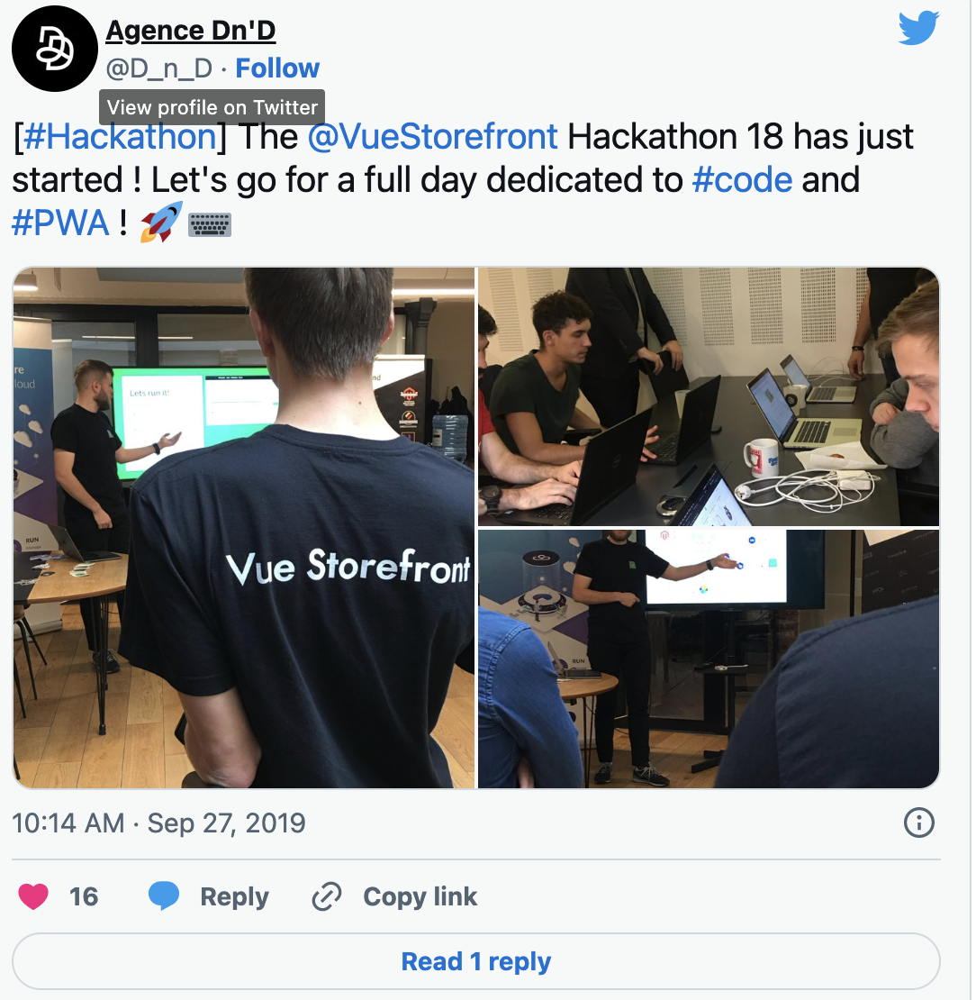
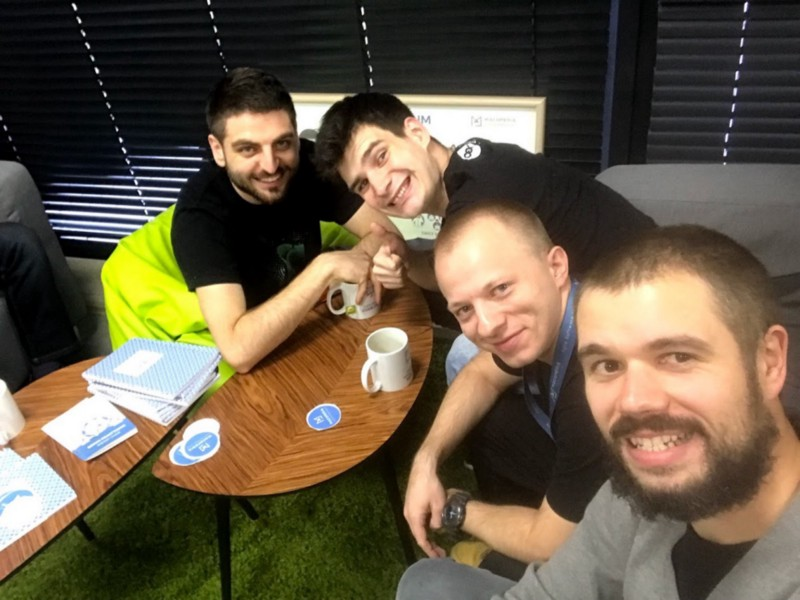
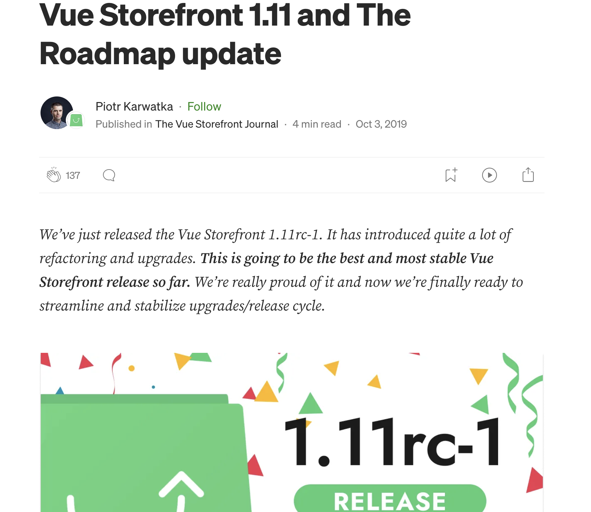
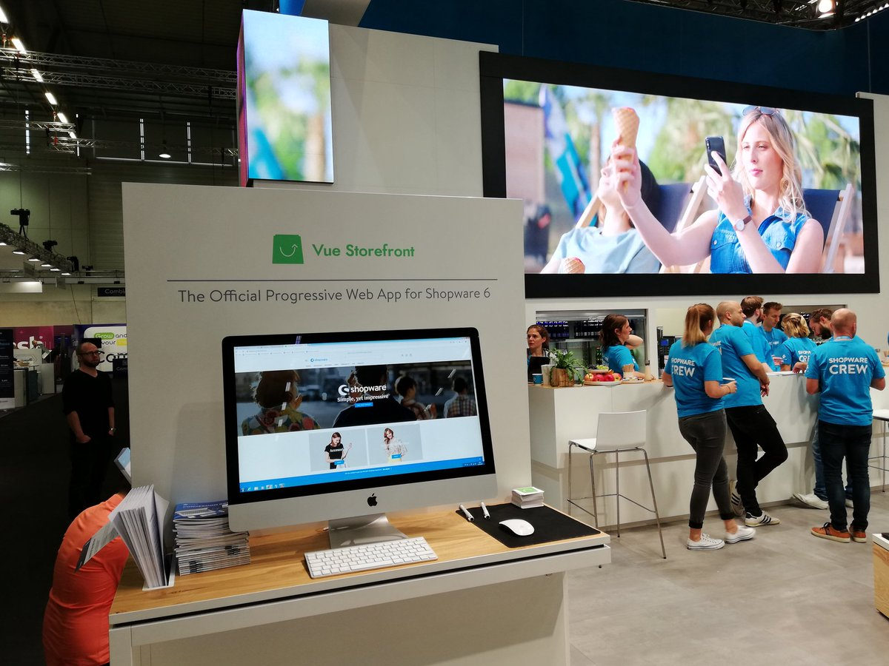

## Don’t pretend. Be. 100% Open Source

Developers have a knack for spotting insincerity a mile away. This is especially true in the world of open source. If you're a company launching a project on Github, full transparency is the only way to go.

A key factor in the success of Refine was our steadfast decision to create genuine open-source software. It didn't start with a direct business model backing it. You might think: isn't that just PR or marketing?

Sure, you could see it that way. But for us, it feels more like our gift to the community. For example they weren't interested in a secondary enterprise license. They chose the MIT license—the most unrestricted open-source license available. 

The urge to monetize this effort can be strong. After all, the monthly cost of any product development can be hefty. But we have to remember our contributors and partners also pay a cost—they dedicate a significant number of hours to the project.

In order to truly engage your contributors, they need to feel a sense of ownership over the project. They need to feel like the project is as much theirs as it is yours. This sense of belonging can be challenging to foster if you kickstart your project behind closed doors, restrict it to a core team, or follow an enterprise model.

No one wants to feel taken advantage of or to think that their hard work is lining your pockets without any return on their investment. This return could be in the form of personal branding, experience, enjoyment, or even the success of their own company. All these factors are equally significant.

## Be inclusive to your community

In the early stages of the Vue Storefront community, I practiced an open-door policy, particularly in regard to Pull Requests. My objective was to create an environment that was welcoming and encouraged participation. I was regularly engaged on Slack, fielding questions and offering assistance with Github issues and pull requests. I found myself dedicating around one to two hours daily to this interaction. The ease with which one could get started and contribute, even with the smallest piece of code, was a major contributor to our thriving community.

_This is a set of photos + screenshot of Twitter post made by our partner (Agence Dn’D). Partners hosted most of the hackathons plus made a great job spreading the news in social media. Our only cost was time and commitment._

As the project matured, the need for more stringent quality assurance measures became apparent. For instance, compatibility back-testing and security testing became integral aspects of my project operations. This more structured approach was notably implemented in my collaboration with SAP on the Spartacus project. However, the key takeaway is to start with an easy, inclusive approach.

The secret recipe is straightforward — dedicate time to your community. Value their contributions, conduct code reviews, give constructive feedback, and offer help to fix their code if needed.

*Unspecified localization, VSF Hackathon, 2018. These folks are core team and they met over Github issues, remotely :)
*
We did almost 20 physical hackathons around the globe including: Amsterdam, New York, Tel Aviw, Berlin, London, Warsaw …. By doing so we gathered around 80+ contributors — about 10 in the core team. It was pre-covid.

## Release early, release often

In the Vue Storefront project, we adhere to a strict monthly release cycle. This commitment serves as a pact with our community, assuring them they can expect a new version every month. However, we don't make any promises about specific features being included in these releases, because our policy is to only incorporate features that are fully ready and have passed all quality checks. **Every release presents a marketing opportunity – it's a chance to create a blog post and gives people a reason to talk about and share news about the project.**

_Everytime we released the new version of Vue Storefront there was a blog post on VSF Journal (no longer available, here’s an archive: [https://medium.com/the-vue-storefront-journal](https://medium.com/the-vue-storefront-journal)). We used it to give some credits to the most active contributors, promote upcoming hackathons and announce initiatives._

## When you feel you’re ready — it’s too late!

Richard Branson once famously said, "If you feel you're ready — it's too late." I've always been a proponent of this lean mindset.

Right from day zero, we initiated our Github repository and focused relentlessly on delivering a minimum viable product (MVP). In our case, that meant developing the essential components such as the home page, product page, and checkout, while intentionally limiting other features. We didn't invest excessive time in areas like dev-ops and automated tests (although, in hindsight, that approach had its drawbacks).

By following this approach, we surpassed similar projects and positioned ourselves for implementation a full year ahead of the competition. You can find further insights into this "be-first-on-the-market" strategy in the classic book, "[Inside the Tornado](https://www.catchthetornado.com/blog/inside-the-tornado-book)" Being the first to market allows for rapid idea validation and the ability to pivot swiftly. It's simply impractical to invest substantial resources into a project that ultimately lacks demand.

## Fancy stuff matters

Vue Storefront's rise in popularity is often attributed to the emergence of the PWA standard, which has gained significant traction (although, to be honest, it wasn't as popular when we first started). Some argue, "But what about the fancy Vue.js and the backend work? Isn't that unfair?

Indeed, it is true. To achieve success, you must create something that resonates with people, something that captures their interest. It's essential to choose a category that is trendy, captivating, and boasts a vibrant community. Unlike behemoths like Microsoft or Google, we don't have the luxury of building entirely new databases, operating systems, or eCommerce admin panels. That's why it's crucial to select the right category where you can thrive. A fantastic resource on this subject is the book "[Escape Velocity](https://www.amazon.com/Escape-Velocity-Free-Companys-Future/dp/0062040898)." Harnessing the power of your chosen category can propel your project's growth, even if you make a myriad of mistakes along the way.

In the realm of music, it's akin to pop music and classical music. Pop music often dominates the charts, attracting widespread attention and a fervent following due to its catchy tunes and modern appeal. On the other hand, classical music, with its rich history and complexity, continues to resonate with a dedicated audience and connoisseurs. Each has its own distinct allure and potential for success. Similarly, in the world of technology, identifying the right category and harnessing its power can pave the way for remarkable growth. \
 \
But common, you probably like to be more Jay-Z, than Bach. 

## No Marketing .. or All In Marketing?

Your core team doubles as your marketing team.

The passion we have for the project naturally propels us to spread the word. Every event we attend results in an influx of stars on Github—20, 50, 100, or even more—as well as new implementations going live. 

This is the beauty of true open source. When you're not trying to sell anything, everyone wants you at their meeting. However, it's important to acknowledge the significant contributions of dedicated marketing teams. 

_At the later stage - when VSF take shape of a stand-alone product we’ve been participating in many industry events (here’s the DMEXCO in Germany)._

They excel at organizing events, forging partnerships, creating compelling content, and more. I'm not suggesting that a marketing team isn't necessary; rather, I emphasize the importance of full engagement from your developers in marketing activities. Without their active involvement, the vibrant and merit-based nature of the project would be compromised.