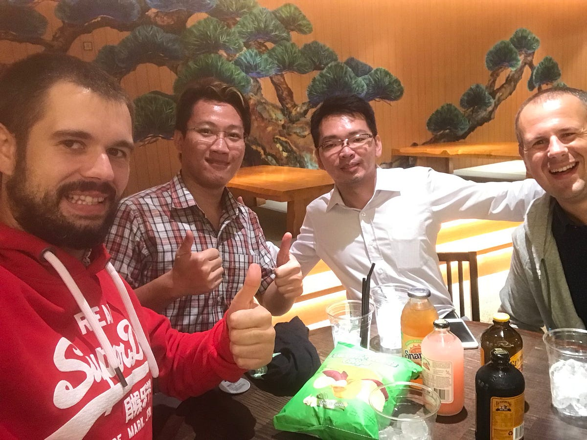
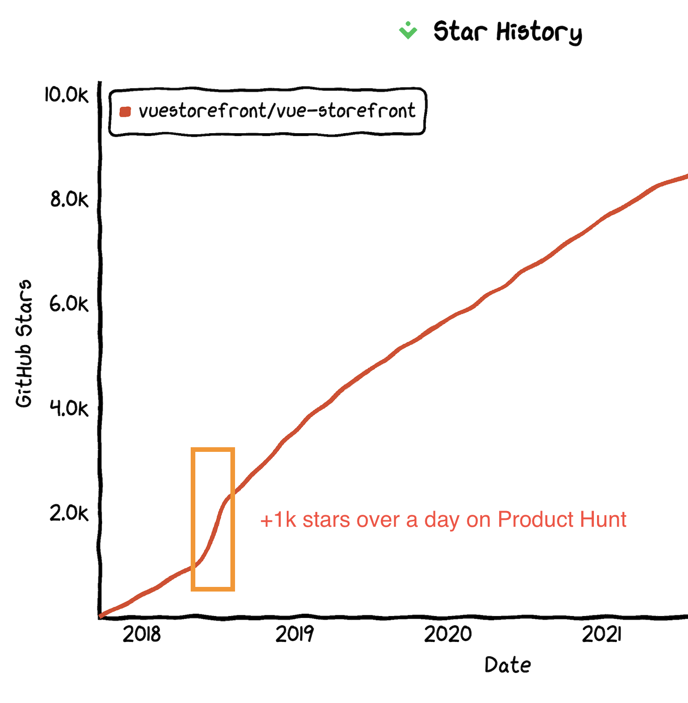
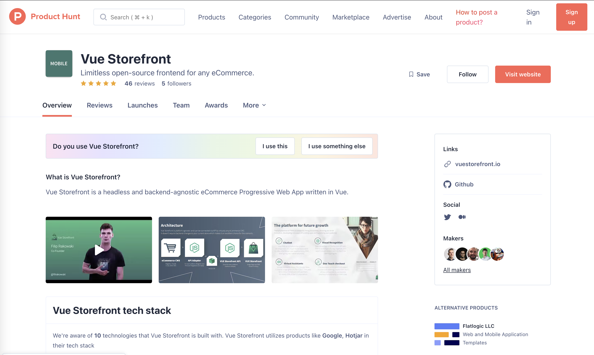
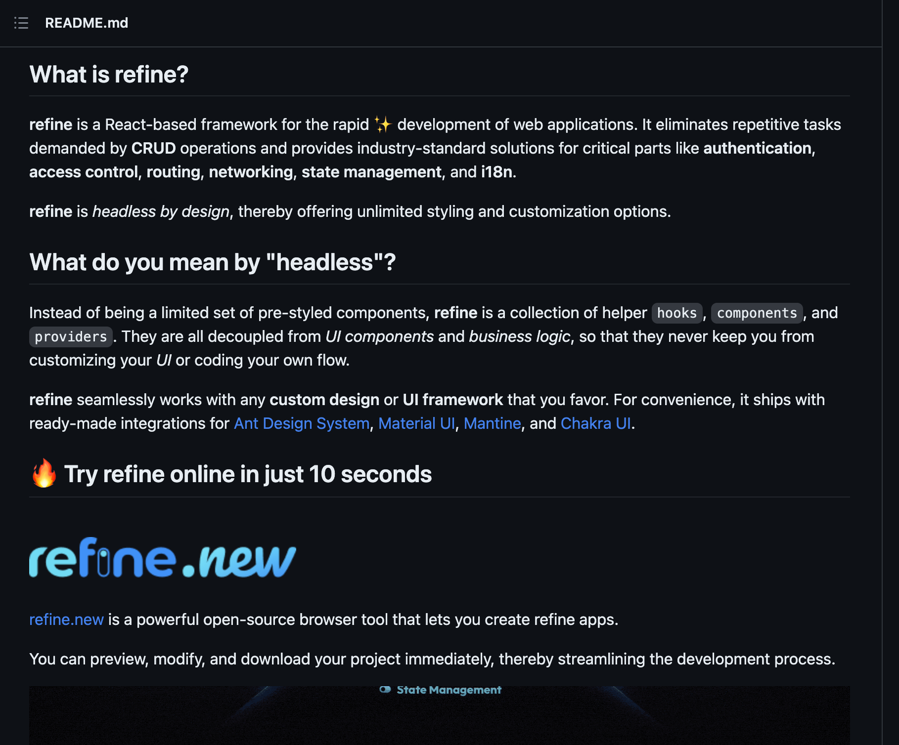
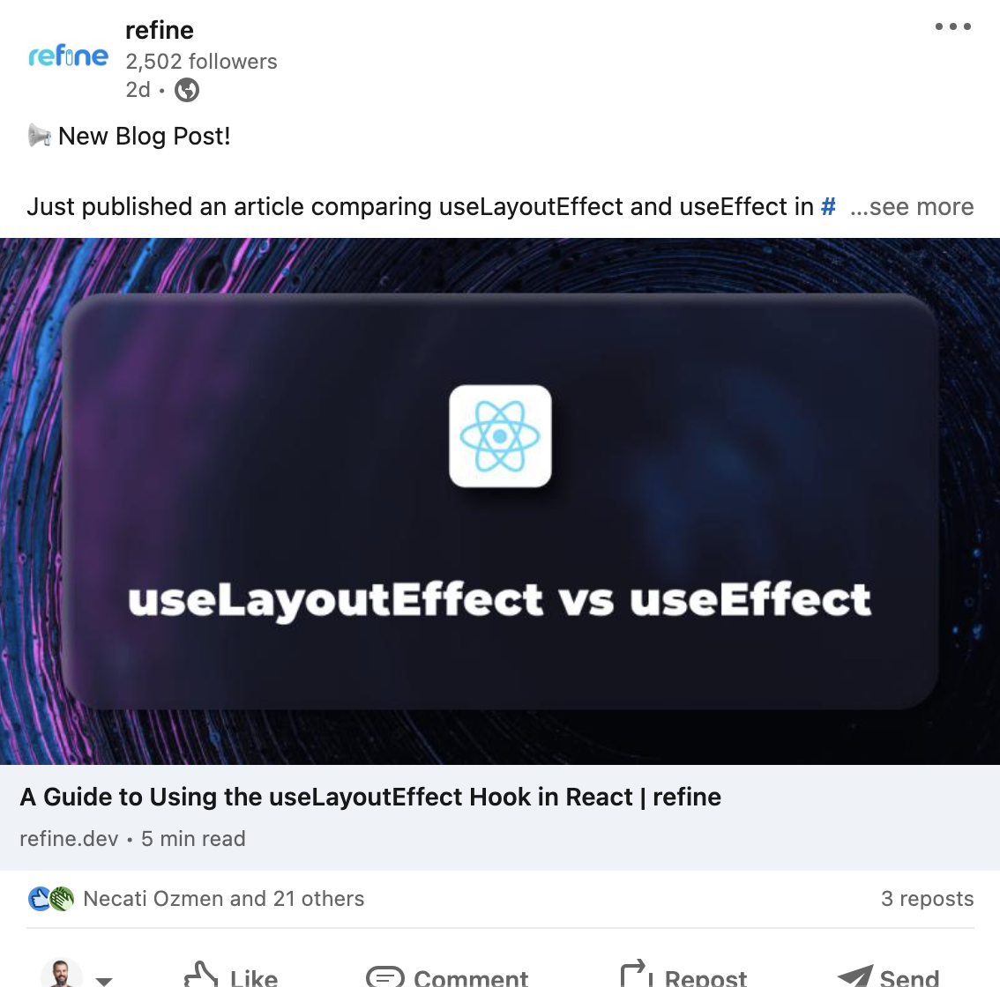

Each product has its unique qualities, so no one-size-fits-all marketing strategy exists. Nevertheless, I believe there are a few tips and techniques that could be beneficial when it comes to promoting open source. Give them a shot!

## Be Bold

Before anyone becomes familiar with you and your project, the only representatives are you and your team. Don't be afraid to be assertive, even if it feels a bit like "fake it till you make it". In truth, it's not about pretending—it's about boldly declaring your aspirations and goals.

*Fake it till you make it. Me, coding VSF 0.3 on the way to NYC.*

We had a wild idea that launching the Vue Storefront Project should take place in New York City. Why, you ask? Well, as the famous saying goes, 

"If you can make it there, you can make it anywhere!" 

That plan was brimming with audacity. So, we jumped headfirst into a keynote at a conference, even though we were still shy of developing version 0.3. The ensuing 50 days were an adrenaline-fueled sprint.

My comrade in arms, Filip Rakowski, and I spent the time coding like mad, creating slide presentations, and figuring out the very essence of our project to ensure it would be ready on the conference day. By some miracle, we pulled it off.

_The thrill of standing on a Broadway theater stage to announce Vue Storefront 0.3 was electric. It looked fantastic on social media and gave us a much-needed boost for the work ahead. After that moment, we knew deep down that this endeavor would be enjoyable, significant, and daring. Above all, it would be worth every effort._

To the social media world, our endeavor appeared exceptionally audacious. Even though my audience numbered around just 20 individuals, it didn't dampen our spirit. Our goal was to revolutionize the way people create eCommerce sites, and we were well on our way to doing just that.

Fast-forward a year, we replicated this daring act when launching Storefront Cloud. This time around, our team was larger, but the conference remained our stage of choice. Again, we spent the final 60 days racing against time, both constructing and marketing our product .. and again we did it! It’s not a chance. It’s your choice. Be bold.

## Partners

Our growth strategy relied heavily on partners, which turned out to be a smart move. While this approach might not suit all products, it worked wonders for our business-to-business and enterprise clientele. Our partners were ecommerce agencies that incorporated Vue Storefront into their services and pitched it to their customers.

At one point, we boasted nearly 100 partners globally. They coordinated hackathons, significantly reducing our cost burden. They also contributed massively to the code and continuously promoted Vue Storefront on social media—since promoting VSF also meant promoting their own agencies.

I believe the best examples of successful partner-channel marketing and sales strategies can be seen in the Magento Community of yesteryears, along with current players like Shopware and WordPress (along with many other projects).

_Our people in Singapore. Having partners around the world is something you can and should do with your open source project. They built the community, they’re the ambassadors. _

## Product Hunt

Product hunt done the right way can boost your product - move to another level. Look at the VSF stars chart. The biggest peak was one single successful Product Hunt Campaign where we got +1000 stars over a day.

*It's crucial to have someone familiar with Product Hunt strategies to help you trend. It's best to have a concise yet captivating video, high-quality screenshots, and an enticing product description. Also, ensure that your product is user-friendly and easy to explore.*

_Great looking PH campaign of Refine.dev, where we managed again to get into Trending. You need to have a good quality content, videos, reviews etc._

## Github trending

Earning a spot in GitHub's Trending section for your product's key topic (like "e-Commerce" in our case) can dramatically increase your star count for days, possibly even weeks. Since many people start their GitHub browsing journey from the trending section, it improves your positioning in GitHub's SEO, among other benefits.

Achieving this requires a significant daily and weekly star boost, often accomplished through various marketing techniques. A successful Product Hunt feature or a well-executed event can frequently drive this kind of engagement.

## Zero momenth of thruth

While open source products are primarily aimed at developers, that doesn't mean they shouldn't be easy to test out. This aligns with the concept of the "First Moment of Truth" in marketing. Your landing page or GitHub project should be accessible within 2-3 minutes. This means you should equip developers with a clear and concise README on GitHub, where they can find a simple 1-2 line CLI command to run the program. Utilizing Docker images, "Deploy on Heroku" or Stackblitz buttons all work well in this context.

_The README.md serves as the initial point of contact or the "zero moment of truth" for your product. The "first moment of truth" arrives when users execute the program using the instructions provided therein._

For Vue Storefront, we ensured users had constant access to an online demo. Plus, we included a CLI installer loaded with sample eCommerce data, making it a breeze to install on localhost within 2-3 minutes.

Refine went a step further by offering a cloud-based product, Refine.new, which is a project generator users can employ to start a new app using the Refine framework. It's akin to create-react-app, a CLI tool which, I would venture to say, was instrumental to React's success in its early days.

## Non-bullshit content

Developers have a finely tuned radar for detecting fluff. So, what bypasses this radar? Something of value. Consider resources like tutorials, new integrations, release notes, and hackathons. While these require some effort, they're undoubtedly worthwhile.

I highly recommend rolling out product updates consistently, ideally aiming for roughly one release per quarter or even better, one per month. This provides opportunities for YouTube hangouts with the core team, blog posts, Twitter discussions, and more.

One of the simplest yet most effective strategies for fostering an open source community and encouraging commitment is acknowledging contributions. Release notes are the perfect place for this. Once credited, the project transforms from being just 'a project' to 'your project' for contributors. 

_When communicating with developers, make sure you always offer something of value. Educational, bite-sized blog posts are excellent for creating lasting interest and are typically well-received by developers_

## Events - offline and online

Events are where the magic happens—it's like a little shindig where folks can hobnob with the core team (or your partners). They can ask questions, let loose, crack open a few brews, and really feel part of the project. And I'm not just talking about conferences, but also hackathons and live-streams. Back in 2019, we took the Vue Storefront party on the road with over 20 hackathons, where our rockstar VSF team jet-setted from the US to Singapore. We delivered speeches, rallied developers, and even tutored first-time contributors. Good times!

_Another photo of the VSF Hackathon. Folks with the VSF emblems are from the core team. Events like these were also great chance for travel, getting know the real users and get some first hand feedback;_

Large-scale gatherings like JSConf and Vue.js Amsterdam can be a hoot, no doubt. But never underestimate the power of hackathons and product-oriented events—they're the real heart and soul of the community, pumping life-giving excitement through its veins!