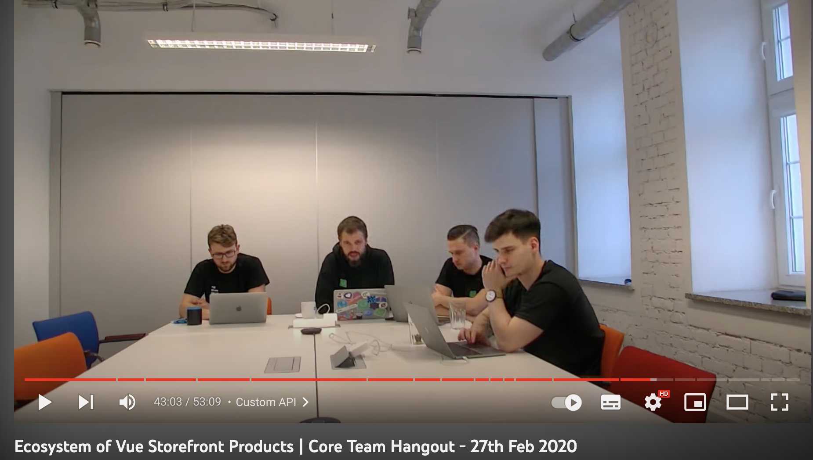
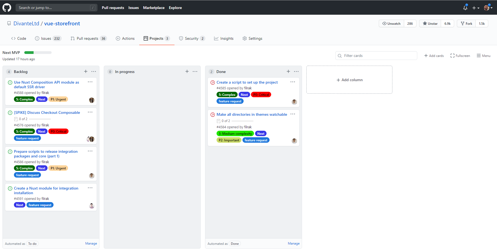
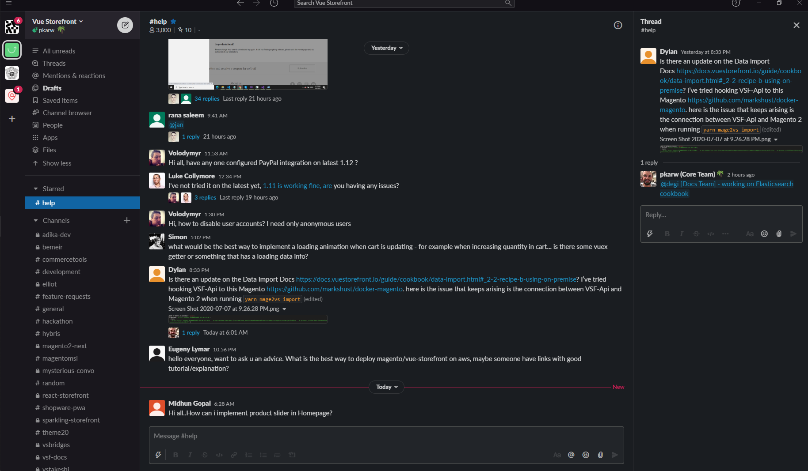
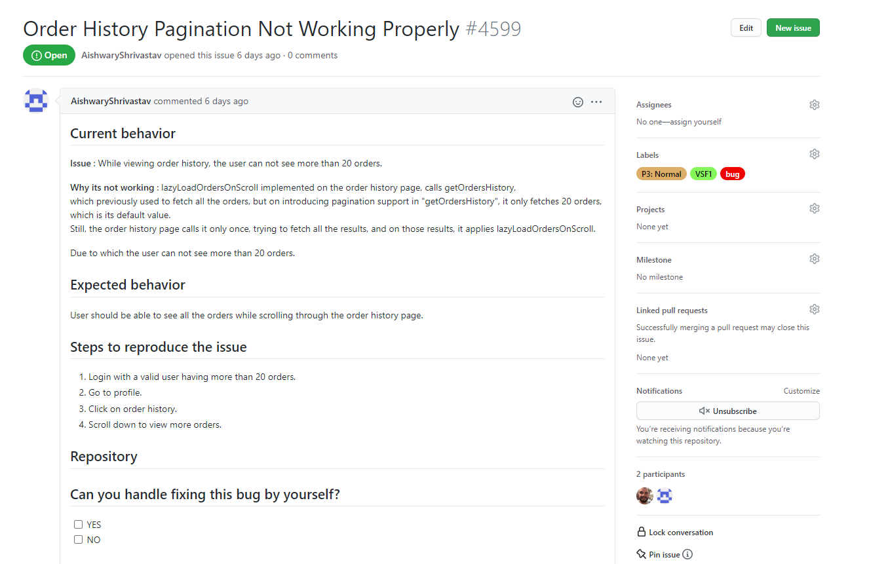
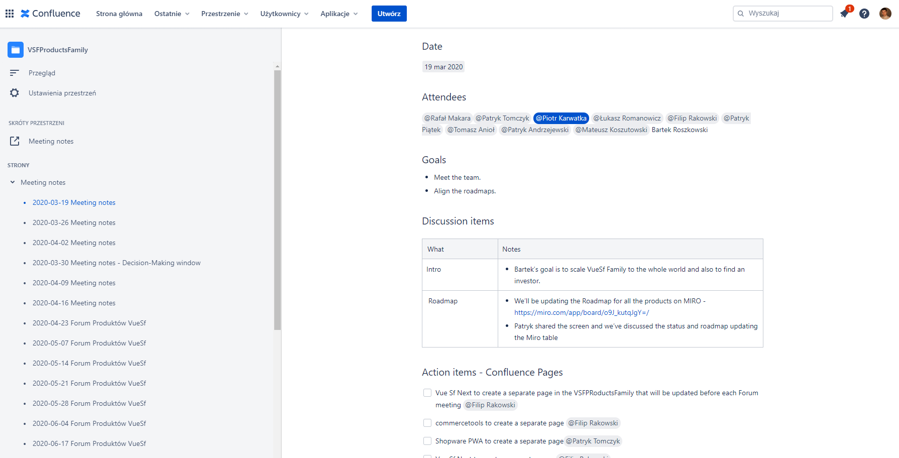

The COVID-19 crisis led to an unexpected work-from-home experiment, with businesses touting their readiness to conquer targets and achieve results remotely. While this may hold true for the short term or smaller teams, if you're seeking a proven example of long-term remote work success, look no further than the realm of open-source software development.

Governing and managing Open Source Project differs slightly from managing the typical enterprise grade project - mostly by the way how to communicate with the developers (and the market), the transparency and the need for highly-engaged and positive communication over widely acceptable tools like Github. 

Open Source is not only a product development, it’s marketing too.

## Transparent Communication

Establishing an efficient communication framework is crucial, and it goes beyond simply having tools like Google Meet, JIRA, and Slack at your disposal. Equally important is implementing a set of ground rules to maintain order and prevent chaos.

A common practice among successful open-source projects is utilizing GitHub issues as a backlog tracker, setting milestones and assigning tickets. We follow a similar approach, leveraging GitHub labels to provide additional categorization and information for the tickets. This streamlined system ensures clarity and organization throughout the project.

_Core Team Hangouts was one of the tools we’ve been constantly using to get in touch with our users and developers. Usually once per quarter, including announcements and AMA (Ask Me Anything) sessions._

For example, a “P0-Urgent” label means that the ticket must be done ASAP. “5: Complex” is a label signifying the complexity/time consumption of a single issue. This way, we can blend planning and prioritization together, without needing to use complex JIRA workflows.

_GitHub is great for managing the project information and backlog. However, it’s not about the tool but how much effort you put to categorize, describe, and manage the information._

The VSF team - in the very early days also used Slack (now they’re on Discord). And I’m talking about a huge community of 3,000 people on the dedicated channel. 

We have divided the Slack workspace into different channels to make it less confusing. For example, the `#development` channel is for thoughts on how Vue Storefront should be developed as a product and issues/ideas regarding the core. As a lot of people, especially newcomers, use Slack to get onboarded, we’ve got a dedicated `#help` channel. In fact, it’s probably one of the most vibrant channels we have and users have started helping each other without any centralized authority.

_In the early days - the Slack was the core communication channel and feedback loop between community and the Vue Storefront Team.  It was open to all and has evolved into a collaboration, planning, and support platform all in one place._

**The core team uses the same tools as the community. In community projects, it’s important to be on the same page, no hidden agenda.**

Despite the fact that Slack gathers the community in one place, we set a rule that no decisions are made on Slack itself. They need to be confirmed in a kind of Github RFC (‘request for comments’ issue) or an e-mail to avoid non-precise decisions, lost information, and so on. 

With a remote setup, you must also fight pre-made assumptions. For example, [putting a plan in 10 bullet points](https://github.com/vuestorefront/vue-storefront/issues/3949) is always better than just a note saying “We’ll fix performance in the next release”. The clarity of information and intent is key to keeping everyone pulling in the same direction.

One way to ensure this is to make an Issue tracker named_ the only source of truth_ for the roadmap and, if possible, all product information.

At some point we’ve added a forum to our communication landscape. This was a dual-purpose action: 

* It has some SEO value to have the questions positioned in the search engines
* It cleans up the GitHub stream of questions not related to the product core

## Self-explanatory tasks 

When working remotely, individuals often operate asynchronously, particularly when they are spread across different time zones. The lack of immediate interaction means they may not have the opportunity to seek additional information easily. As a result, we swiftly realized the importance of being highly specific and providing ample contextual information within the tasks we create on GitHub. These tasks typically include guidance on how the assigned work should be implemented, ensuring clarity and minimizing ambiguity.

The most important aspect is: **the Acceptance Criteria** and **reference materials**. These two features will let the folk taking care of this task find more info even when there’s nobody to ask.

_With remote work, your issues need to be self-explanatory. Provide a lot of context and reference information to let people work fully remotely._

We’ve even got a template where you cannot miss these key parts of a new feature request or a bug report.

## Product planning and statuses

The whole network of contributors (around 186) and partners (80+) was managed by a relatively small core team (around 6 people, though it depends how you count because we’ve grown from a single project to a [whole ecosystem](https://blog.vuestorefront.io/ecosystem-of-vuestorefront/)). The Core team has been used to working remotely from day one and has used Slack for daily communication and Hangouts for **weekly** product status meetings.

We kept notes in Confluence, though it could be Google Docs or Notion. Whatever you use, it should be a collaborative, online tool. We put notes after every meeting with all the decisions and action points.

_We didn’t use JIRA but we did Confluence. The most important thing about making decisions is to document them all along. We have a log of the meetings with all the action points, and decisions in a single wiki space._

We learnt this the hard way, after a few months of making quick decisions online as questions arose via Slack or over calls. We strongly recommend against it once you have more than a couple of people on a project, as things quickly get too complex.

Our product management process at some point was kind of moderated forum. The product streams were synchronized but every team has a lot of space to make their own decisions. This is the only way for smaller teams to effectively build the products. If you make them wait for the results or decisions of each other’s work, it stops the whole machine working. Your process must be async-friendly. You can set the direction but teams need to set their own goals.

## Make the onboarding easy and fun

If you’re looking for volunteers and they work remotely, it’s very important to get them onboard as soon as they show interest in your project. 

We started with a [“README.md”](https://github.com/vuestorefront/vue-storefront#readme) with all set of links to the docs and installation procedure for the project and then a [“CONTRIBUTING.md”](https://github.com/vuestorefront/vue-storefront/blob/main/CONTRIBUTING.md) file which includes all the info on how to pick your first issue, how to create a Pull Request, and where to find help.

There is also a whole range of issues marked as “Good first issue”. These are generally easy to execute and are mostly bug-fixes or minor feature requests. They are tasks that let new folks contribute something meaningful within two or three hours.

 \
We also sent the official Vue Storefront t-shirts and hoodies. It was great to see all the contributors wearing them at the Zoom meeting. It builds a kind of emotional engagement which is especially difficult to achieve in remote-only setups.

## It’s all about ownership and fun

When you have a team on a payroll, you may simply instruct them to perform tasks. However, in the open-source world, things operate differently. This principle holds true beyond open-source as well. In an ideal scenario, your team should be so proactive and motivated that they willingly tackle tasks even before you have the chance to ask them. It's a testament to their enthusiasm and initiative, creating a dynamic where they actively seek opportunities to contribute beyond expectations.

Ownership was at the core of our values. When someone expressed interest in working on a feature, we embraced it with open arms. We never responded with, "That's a great idea, but maybe John will handle it." Ownership surpassed experience, team position, or any other factor. It was a rare and delicate quality that often signaled future success.

We prioritized coaching and support in the Code Review process and RFC (Request for Comments) process. We encouraged contributors to conduct a reality check with users before implementing substantial changes, further enhancing their ownership. Within our [release notes](https://medium.com/the-vue-storefront-journal/vue-storefront-1-10-rc-cf84e036dd40), we always acknowledged and credited even the smallest contributions. Ownership entailed responsibility and commitment from the contributor, and we believed it deserved genuine appreciation in return.

## Giving feedback in open-source projects

Giving Feedback is difficult even in friendly, face-to-face conditions—especially when the feedback is critical. In remote setup, it can be even harder. 

I suggest not passing on any negative feedback in written-only form. Slack and e-mail are not ideal but a GitHub comment is by far the worst option as it’s visible to all other contributors. It’s far better to have a call and discuss things first, then maybe put some constructive action points in a wrap-up email. Be positive and, moreover, constructive with the feedback you give people.

## Open-source development is a people business

Building a community has taught us that open-source projects are a people business. If possible, you should do some face-to-face catch-ups with the team. We’ve been doing a lot of hackathons around the globe (over 20 per year at the peak). People had a chance to meet us personally, ask questions, and drink a beer together.

We’ve also had live, full-remote webinars in a kind of Ask Me Anything format. These helped close the gap and put everyone on the same page. I think this kind of open communication is very important in a remote setup. People don’t catch you at the watercooler and these all-hands sessions give much more chance to get the important questions answered. 
